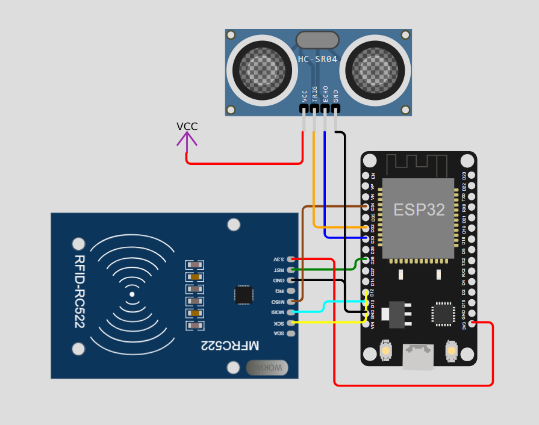
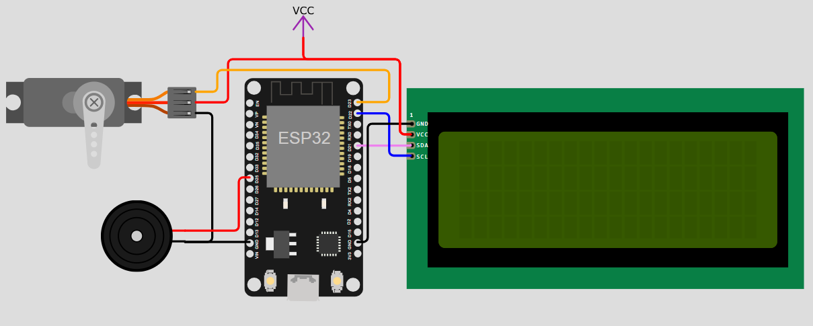

# Sistema IoT de Control y Registro Horario

## Universidad de Antioquia  
**Departamento de Ingeniería Electrónica y Telecomunicaciones**  
Abril 2026

---

## Integrantes
- **Leyder Homero Marcillo Mera**  
  📧 leyder.marcillo@udea.edu.co  
- **Brayan Estiben Gomez Carmona**  
  📧 Brayan.gomezc@udea.edu.co  
- **Johan David Rojas Martinez**  
  📧 Johan.Rojasm@udea.edu.co  

---

## Descripción del Proyecto
Este sistema IoT permite el **control y registro horario** mediante el uso de un microcontrolador ESP32 DevKit V1, integrando sensores y actuadores para la gestión de acceso y monitoreo.  
El proyecto se desarrolló en **ESP-IDF con FreeRTOS**, garantizando robustez y modularidad.

---

## Elementos Usados
- Microcontrolador DOIT ESP32 DevKit V1  
- Servomotor MG996R  
- Lector RFID-RC522  
- Sensor de distancia HC-SR04  
- Display LCD 20x4 con I2C  
- Buzzer  
- Tags RFID  

---

## Esquemas de Conexión
### Sensores

### Actuadores

---

## Video de Funcionamiento
Video ilustrando la funcionalidad de la capa de percepción tanto para sensores como para actuadores:  
[Ver video en YouTube](https://youtu.be/R0P2l0OCHX4)  
URL: `https://youtu.be/R0P2l0OCHX4`

